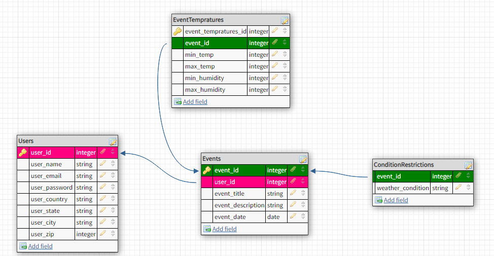
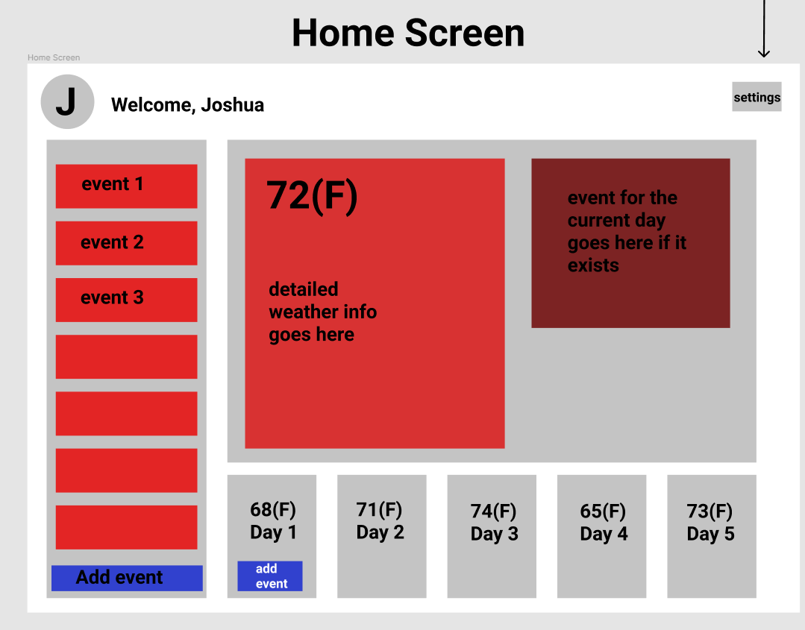
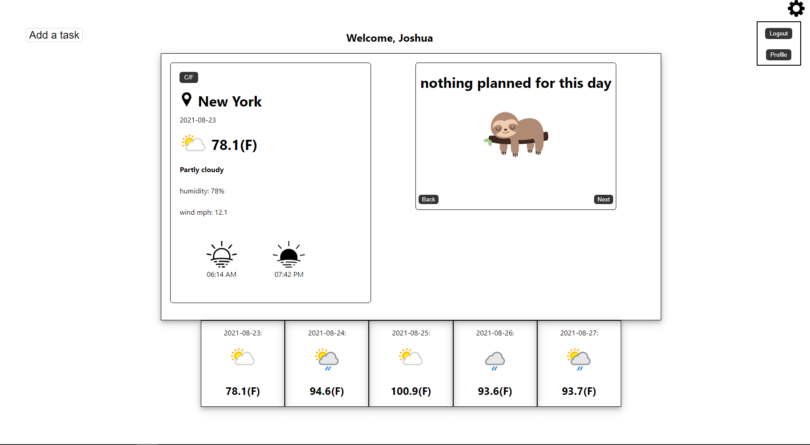
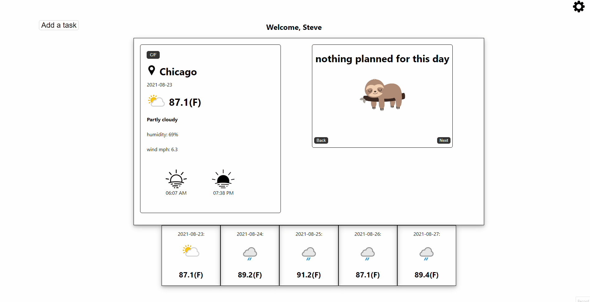
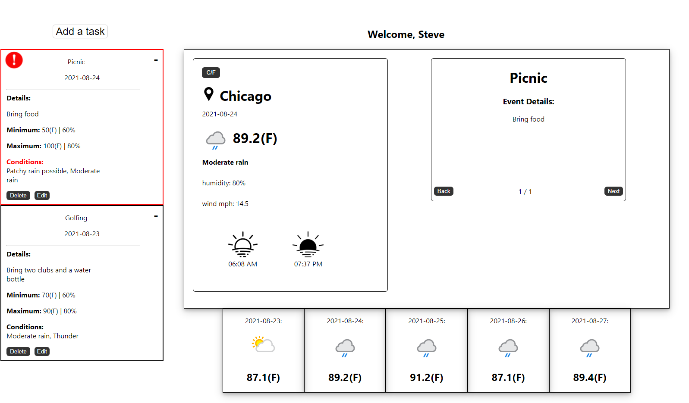

# Sky Planner

https://sky-planner.herokuapp.com/

Sky Planner is a fullstack web application that allows users to create an account, log in, and plan tasks with weather alerts triggered by user customized values such as temperature ranges, humditiy, and sky conditions (rain, thunder, snow, etc). A five day weather forecast is provided and users can plan events tied to specific days and have the app watch for certain weather conditions that may affect their schedueled plans and outings. All in-app weather data used from https://www.weatherapi.com

## Features

- Users can create plans and have the app watch for humidity and temperature ranges as well as weather conditions
- Users can edit and delete their plans
- Users can easily swap between fahrenheit and celsius with a toggle button on the home page
- Users can update their name and location at any time

## Languages

1. HTML
2. CSS
3. Javascript

## Technologies & Packages

- Express, Axios, React, Redux, Sequelize, Postgres, Lodash, Modal

## Details

This app was built using the Javascript component based library 'React' along with 'Redux' to efficiently manage global state. All server side code was written with the Express package. A Postgres database hosted by Heroku was used to store user information and database communications was handled with Sequelize in the source code.

## Data Modeling

## Initial Low Fidelity Mockup

## Home Page Design

mdImages/

## Creating an Event

**When an alert is triggered due to the user's specifications it will appear red and pronounced with an alert symbol**

